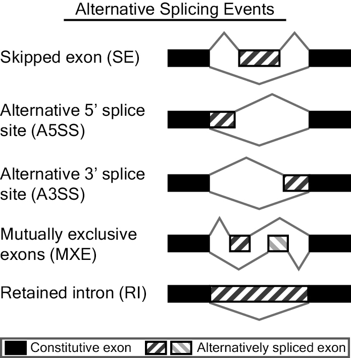

# awesome-alternative-splicing
## What is this?
This is a resource for software and information about alternative splicing. [Contributions welcome](https://github.com/hussainather/awesome-alternative-splicing/blob/master/CONTRIBUTING.md)...

## Types of alternative splicing
 - Skipped exon or cassette exon (SE): An exon can be retained or spliced out of the primary transcript.
 - Mutually exclusion exons (MXE): One of two exons is retained in mRNA splicing, but not both.
 - Alternative 5' splice site (A5SS): An alternative 5' splice junction (donor site) is used that changes the 3' boundary of the upstream exon.
 - Alternative 3' splice site (A3SS): An alternative 3' splice junction (acceptor site) is used that changes the 5' boundary of the downstream exon.
 - Retained intron (RI): A sequence may be spliced out as an intron or retained, and there are no flanking introns.

 

Source: http://rnaseq-mats.sourceforge.net/rmats3.0.9/

## Software packages
+ [ALEXA-Seq](http://www.alexaplatform.org/alexa_seq/) - alternative expression analysis by massively parallel sequencing.
+ [Cufflinks](http://cole-trapnell-lab.github.io/cufflinks/) - assemble and quantify transcripts. 
+ [flotilla](https://github.com/yeolab/flotilla) - reproduce machine learning analysis of gene expression and alternative splicing data.
+ [GMAP and GSNAP](http://research-pub.gene.com/gmap/) - detect complex variants and splicing in short reads, SNP-tolerant.
+ [G-Mo.R-Se](http://www.genoscope.cns.fr/externe/gmorse/) - maps splice junctions to genome. 
+ [HMMSplicer](http://derisilab.ucsf.edu/index.php?software=105) - discovery canonical and non-canonical splice junctions in short read datasets.
+ [MapSplice](http://www.netlab.uky.edu/p/bioinfo/MapSplice2) - map RNA-seq data to reference genome for splice junction discovery.
+ [MISO](http://genes.mit.edu/burgelab/miso/) - determine alternative splicing expression. 
+ [MMES](https://www.ncbi.nlm.nih.gov/pmc/articles/PMC2798953/) - statistically determine alternative splicing.
+ [outrigger](https://github.com/YeoLab/outrigger) - calculate alternative splicing scores of RNA-Seq data based on junction reads and a de novo, custom annotation created with a graph database, especially made for single-cell analyses.
+ [rMATS](http://rnaseq-mats.sourceforge.net/) - RNA-Seq Multavariate Analysis of Transcript Splicing. [Reading rMATS output](https://www.biostars.org/p/256949/)
+ [rmats2sashimiplot](https://github.com/Xinglab/rmats2sashimiplot/) - visualize rMATS output using sashimi plots.
+ [Scripture](http://software.broadinstitute.org/software/scripture/) - reconstruct transcript isoforms.
+ [SingleSplice](https://github.com/jw156605/SingleSplice) - detect biological variation in alternative splicing within a population of single cells. 
+ [SpliceMap](https://web.stanford.edu/group/wonglab/SpliceMap/) - discover and align splice junctions for RNA-Seq reads.
+ [SpliceR](http://www.bioconductor.org/packages/2.13/bioc/html/spliceR.html) - detect alternative splicing and predict coding potential. 
+ [SplicingCompass](https://www.leibniz-hki.de/en/SplicingCompass.html) - detect differential splicing using RNA-Seq data.
+ [SplitSeek](https://solidsoftwaretools.com/splitseek) - predict splice events from RNA-Seq data.
+ [STAR](https://code.google.com/archive/p/rna-star/) - identify alternative splicing.
+ [TopHat](http://ccb.jhu.edu/software/tophat/index.shtml) - map splice junctions for RNA-Seq reads.

## Review of RNA-Seq splicing tools
**Tool**|**Performs split-read alignment**|**Transcript reconstruction (assembly)**|**Expression Analysis (any)**|**Gene expression analysis**|**Transcript specific expression analysis**|**Exon junction expression**|**Quantitative alternative expression analysis**|**Expression level sensitivity**|**Output**|**Minimum read length required or recommended**|**Visualization tool**|**Performs comparisons between conditions (ex. tumor vs normal)**|**Relevant comparison to Alexa-seq**|**Data type supported**|**Citation**
:-----:|:-----:|:-----:|:-----:|:-----:|:-----:|:-----:|:-----:|:-----:|:-----:|:-----:|:-----:|:-----:|:-----:|:-----:|:-----:
Alexa-Seq|N|N|Y|Y|Y|Y|Y|Junction|"Expression and structure information for junctions and genes; UCSC track info| extensive alternative expression visualization / statistics / graphs"|No minimum (tested on 36bp-100bp reads)|"Extensive| includes custom graphs and links to UCSC browser"|Y|-
Cufflinks|N|Y|Y|Y|Y|N|Y|Transcript|"Transcript information and expression statistics| BED| GTF"|75bp|UCSC browser|Y|Y
Scripture|N|Y|Y|N|N*|N|N|Transcript*|"Transcript structure information and non-parsimonious expression statistics| BED"|75bp|UCSC browser|N|N|Illumina
SpliceMap|N|N|Y|Y|N|Y|N|Junction|"Alignments. SAM| BED| Wig"|50bp|UCSC browser|N|N
TopHat|Y|N|N|N|N|Y|N|Junction|"Alignments. SAM| BED| Wig"|75bp|N|N|N
MMES|Y|N|N|N|N|Y|N|Junction|Identified splice junctions and p-values|25bp|N|N|N|Illumina|"Wang et al.
G-Mo.R-Se|Y|Y|N|N|N|N|N|Transcript*|Transcript structure information.  GFF|25bp|Grape Genome Browser|N|N|Illumina|"Denoeud et al.
SplitSeek|Y|N|N|N|N|Y|N|Junction|Alignments.  BED|50bp|UCSC browser|N|N|SOLiD only|"Ameur et al.2010
GSNAP|Y|Y|N|N|N|N|N|N/A|Alignments.  SAM and FASTA|Minimum 14bp (tested on 36bp reads)|UCSC browser|N|N|Illumina | sodium bisulfite-treated DNA sequencing (for analysis of methylation status)|"Wu and Nacu

**Tool**|**Performs split-read alignment**|**Transcript reconstruction (assembly)**|**Expression Analysis (any)**|**Gene expression analysis**|**Transcript specific expression analysis**|**Exon or Junction expression**|**Quantitative alternative expression analysis**|**Expression level sensitivity**|**Output**|**Minimum read length required or recommended**|**Ability to identify rearrangements / indels**|**Junction Identification**|**Implementation**|**Public tool**|**Open Source**
:-----:|:-----:|:-----:|:-----:|:-----:|:-----:|:-----:|:-----:|:-----:|:-----:|:-----:|:-----:|:-----:|:-----:|:-----:|:-----:
Alexa-seq|N|N|Y|Y|Y|Y|Y|Junction|"Expression and structure information for junctions and genes; UCSC track info| extensive alternative expression visualization / statistics / graphs"|No minimum (tested on 36bp-100bp reads)|N|Database|Perl/R/Unix|Y
Cufflinks|N|Y|Y|Y|Y|N|Y|Transcript|"Transcript information and expression statistics| BED| GTF"|75bp|N|Predicted from data|C++
Scripture|N|Y|Y|N|N*|N|N|Transcript*|"Transcript structure information and non-parsimonious expression statistics| BED"|75bp|N|Predicted from data|Java|Y
SpliceMap|N|N|Y|Y|N|Y|N|Junction|"Alignments. SAM| BED| Wig"|50bp|N|Predicted from data|Python
TopHat|Y|N|N|N|N|Y|N|Junction|"Alignments. SAM| BED| Wig"|75bp|N|Predicted from data|C++/Python
MMES|Y|N|N|N|N|Y|N|Junction|Identified splice junctions and p-values|25bp|N|Predicted from data|Published algorithm only|N|N/A
G-Mo.R-Se|Y|Y|N|N|N|N|N|Transcript*|Transcript structure information.  GFF|25bp|N|Predicted from data|Perl|Y**|Y
SplitSeek|Y|N|N|N|N|Y|N|Junction|Alignments.  BED|50bp|Y|Predicted from data|Perl|Y|Y (GPL)
GSNAP|Y|Y|N|N|N|N|N|N/A|Alignments.  SAM and FASTA|Minimum 14bp (tested on 36bp reads)|Y|Database or predicted form data|"Source code in C| utility programs in Perl"|Y
Tool|Performs split-read alignment|Transcript reconstruction (assembly)|Expression Analysis (any)|Gene expression analysis|Transcript specific expression analysis|Exon or Junction expression|Quantitative alternative expression analysis|Expression level sensitivity|Output|Minimum read length required or recommended|Ability to identify rearrangements / indels|Junction Identification|Implementation|Public tool|Open Source
Alexa-seq|N|N|Y|Y|Y|Y|Y|Junction|"Expression and structure information for junctions and genes; UCSC track info| extensive alternative expression visualization / statistics / graphs"|No minimum (tested on 36bp-100bp reads)|N|Database|Perl/R/Unix|Y
Cufflinks|N|Y|Y|Y|Y|N|Y|Transcript|"Transcript information and expression statistics| BED| GTF"|75bp|N|Predicted from data|C++
Scripture|N|Y|Y|N|N*|N|N|Transcript*|"Transcript structure information and non-parsimonious expression statistics| BED"|75bp|N|Predicted from data|Java|Y
SpliceMap|N|N|Y|Y|N|Y|N|Junction|"Alignments. SAM| BED| Wig"|50bp|N|Predicted from data|Python
TopHat|Y|N|N|N|N|Y|N|Junction|"Alignments. SAM| BED| Wig"|75bp|N|Predicted from data|C++/Python
MMES|Y|N|N|N|N|Y|N|Junction|Identified splice junctions and p-values|25bp|N|Predicted from data|Published algorithm only|N|N/A
G-Mo.R-Se|Y|Y|N|N|N|N|N|Transcript*|Transcript structure information.  GFF|25bp|N|Predicted from data|Perl|Y**|Y
SplitSeek|Y|N|N|N|N|Y|N|Junction|Alignments.  BED|50bp|Y|Predicted from data|Perl|Y|Y (GPL)
GSNAP|Y|Y|N|N|N|N|N|N/A|Alignments.  SAM and FASTA|Minimum 14bp (tested on 36bp reads)|Y|Database or predicted form data|"Source code in C| utility programs in Perl"|Y
Tool|Performs split-read alignment|Transcript reconstruction (assembly)|Expression Analysis (any)|Gene expression analysis|Transcript specific expression analysis|Exon or Junction expression|Quantitative alternative expression analysis|Expression level sensitivity|Output|Minimum read length required or recommended|Ability to identify rearrangements / indels|Junction Identification|Implementation|Public tool|Open Source
Alexa-seq|N|N|Y|Y|Y|Y|Y|Junction|"Expression and structure information for junctions and genes; UCSC track info| extensive alternative expression visualization / statistics / graphs"|No minimum (tested on 36bp-100bp reads)|N|Database|Perl/R/Unix|Y

\* Transcript expression values are non-parsimonious

\** Not supported (current version not stable)
